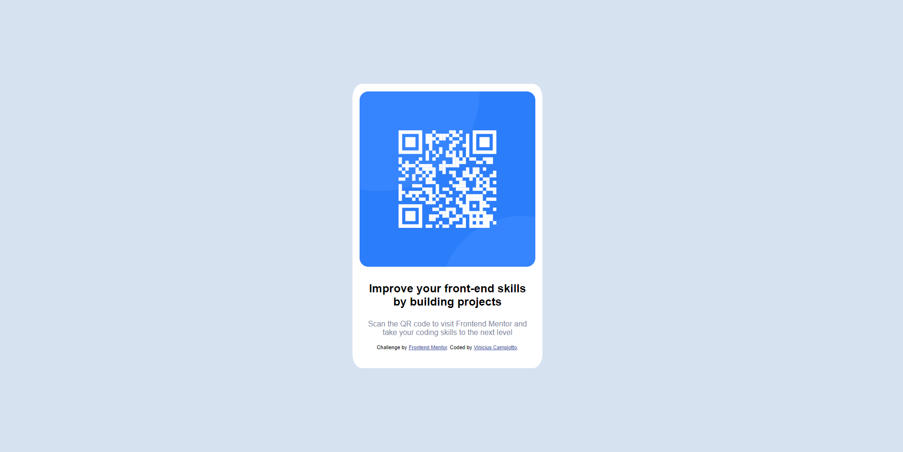

# Frontend Mentor - QR code component solution

This is a solution to the [QR code component challenge on Frontend Mentor](https://www.frontendmentor.io/challenges/qr-code-component-iux_sIO_H). Frontend Mentor challenges help you improve your coding skills by building realistic projects.

### Screenshot

### Links

- Solution URL: [Add solution URL here](https://your-solution-url.com)

### Built with

- Semantic HTML5 markup
- CSS custom properties
- Flexbox

### What I learned

I developed this project to make my HTML5 and CSS foundations stronger. Paying attention to semantics and adjusting styles in CSS.

### Continued development

Carry out the execution of a project made from scratch, being built little by little. It's very satisfying! Even though at times I feel stuck, this will pass. And I will add more knowledge.

## Author

- Linkedin - [Vinicius José Campiotto dos Santos](https://www.linkedin.com/in/vinicius-campiotto-421233250/)
- Frontend Mentor - [@Campiottocodes](https://www.frontendmentor.io/profile/Campiottocodes)
